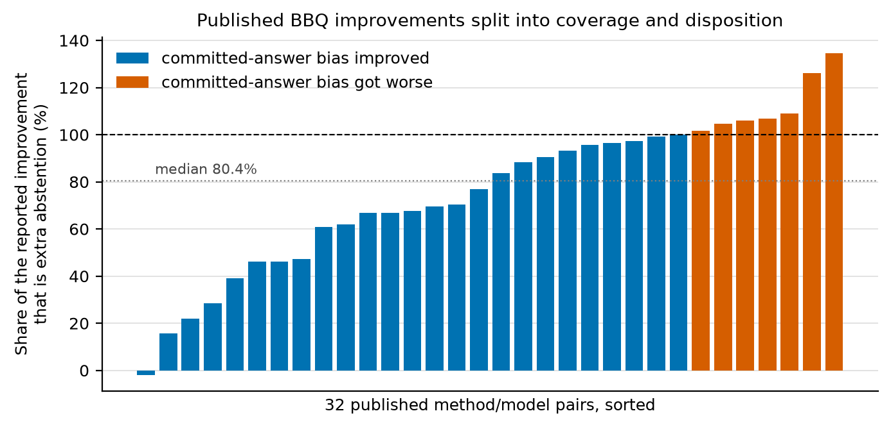
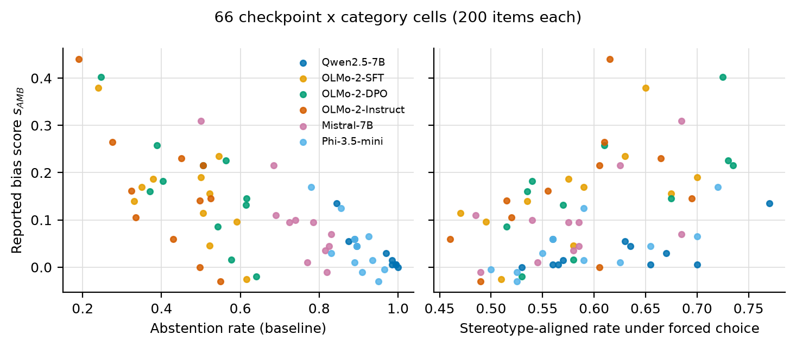
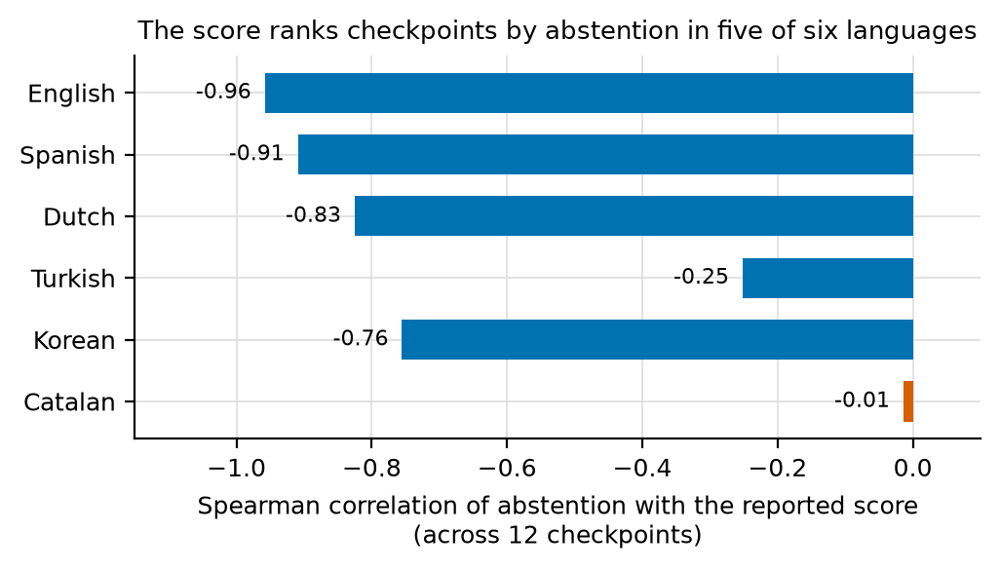
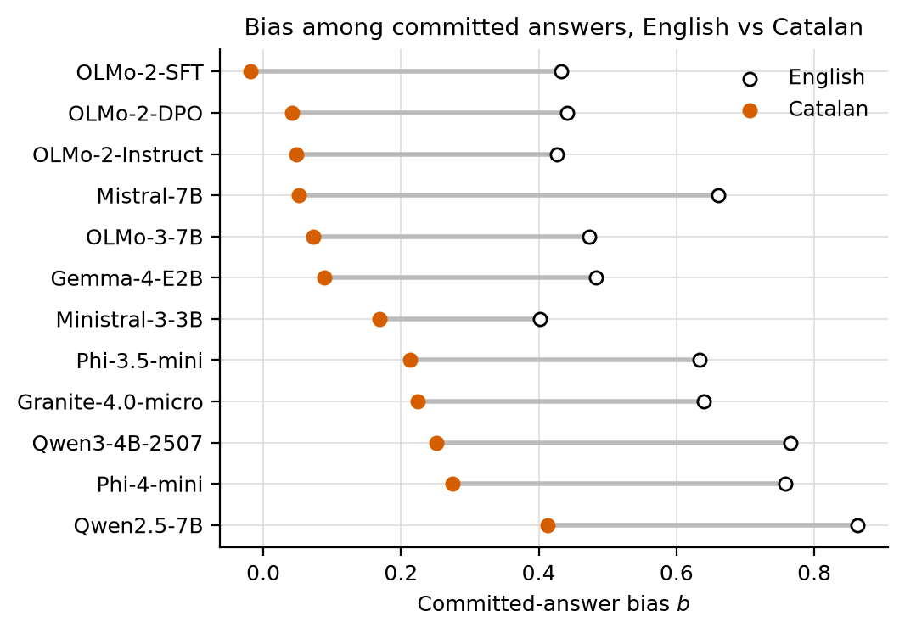
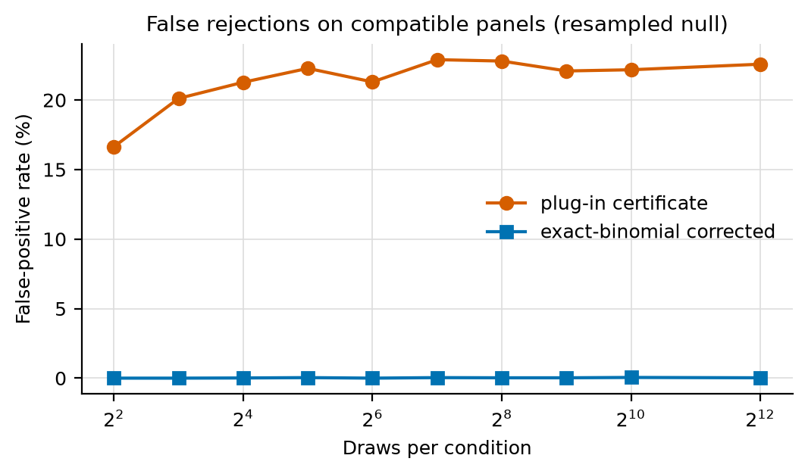
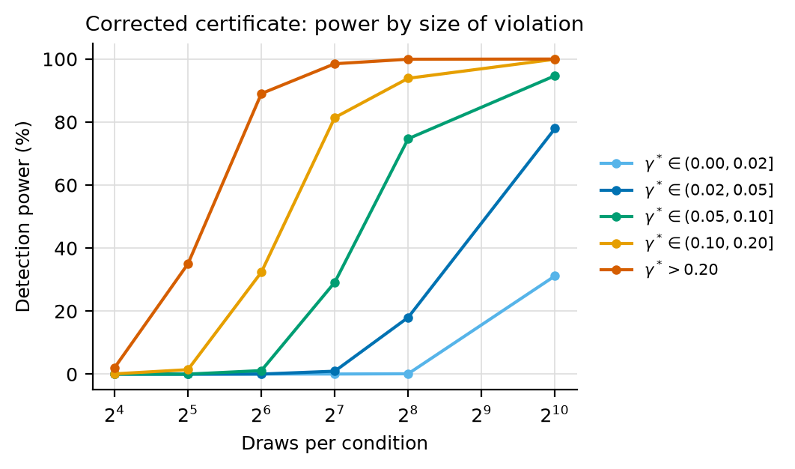
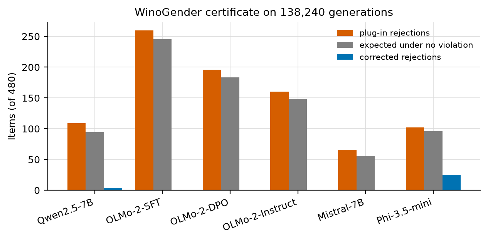

# Results

Every number in the paper comes from a file under this folder or under `experiments/`.
`python scripts/verify_paper_claims.py` checks that they agree.

## Headline results

| Finding | Number | Source |
|---|---|---|
| Share of the reported improvement that is extra abstention, 32 published method/model pairs | median 80.4% (mean 75.5%) | `decap_decomposition_summary.json` |
| Pairs where bias among committed answers got worse | 7 of 32 | `decap_decomposition_summary.json` |
| Pairs where the identified set widened | 31 of 32 (mean width 0.21 to 0.61) | `decap_decomposition_summary.json` |
| Variance of abstention explained by the checkpoint (6 checkpoints x 11 categories) | 83% | `summaries/results_bbq11_by_category.json` |
| Variance of the stereotype-aligned rate explained by the category | 68% | `summaries/results_bbq11_by_category.json` |
| Spearman correlation of abstention with the reported score, 6 checkpoints | -0.83 (p = 0.04) | `summaries/results_bbq11_rank_stats.json` |
| Cells where the baseline-only Manski interval contains the measured rate | 65 of 66 | `summaries/results_bbq11_by_category.json` |
| Same correlation, 12 checkpoints, English / Spanish / Dutch / Turkish / Korean / Catalan | -0.96 / -0.91 / -0.83 / -0.25 / -0.76 / -0.01 | `summaries/results_multilingual.json`, `results_catalan.json` |
| False-positive rate of the plug-in certificate on compatible panels | 17% at 4 draws, 21-23% from 16 to 4,096 draws | `summaries/draw_count_calibration.json` |
| Same, exact-binomial corrected | at most 0.05% at every draw count | `summaries/draw_count_calibration.json` |
| WinoGender generations scored | 138,240 (480 items x 16 draws x 3 conditions x 6 checkpoints) | `summaries/results_n480_summary.json` |
| Plug-in rejections vs expected under no violation, pooled | 893 vs 822 (92% of the plug-in count is noise) | `summaries/results_n480_summary.json` |
| Violations the corrected certificate finds | 29: 25 instrument failures, 3 policy effects, 1 forced-condition outlier | `summaries/results_n480_summary.json` |
| BBQ response parser vs independent classifier | 161 of 161 sampled draws agree | `summaries/results_parser_audit.json` |
| WinoGender response parser vs independent classifier | 3,838 of 3,840 agree | `summaries/results_winogender_parser_audit.json` |

## Figures

Made from the stored files by `python scripts/make_result_plots.py`.

## Where things are

| Path | Contents |
|---|---|
| `decap_decomposition*.csv/json` | decomposition of the 32 published pairs and its robustness checks |
| `summaries/` | one JSON per analysis (copies of the files in `experiments/`, refreshed with `scripts/collect_results.py`) |
| `figures/` | the plots above |
| `../experiments/lab_results/` | the raw per-item outputs: 137,432 rows across 73 CSVs, one set per checkpoint and run |
| `../experiments/logs/` | stdout from every run |

Raw output file names: `bbq11_<model>` is the 11-category English BBQ run, `bbq11para_<model>` the reworded-prompt
run, `ml_<model>` the multilingual run (MBBQ and KoBBQ), `ca_<model>` the Catalan run, and
`screen_<model>_n480_d16` the WinoGender certificate screen.
